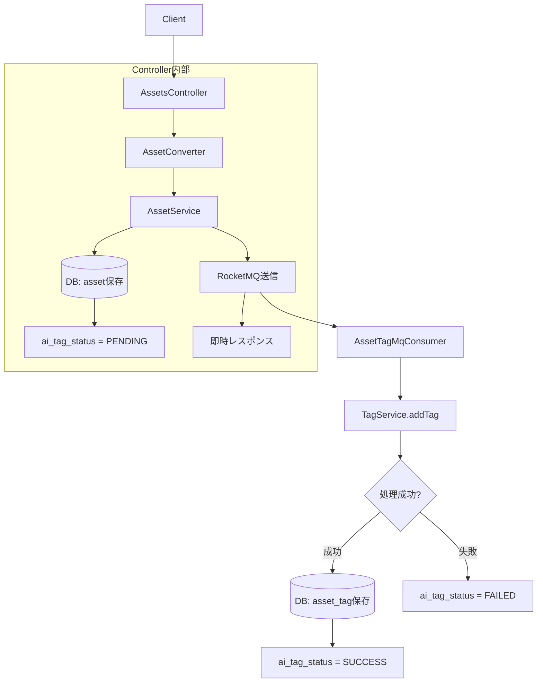
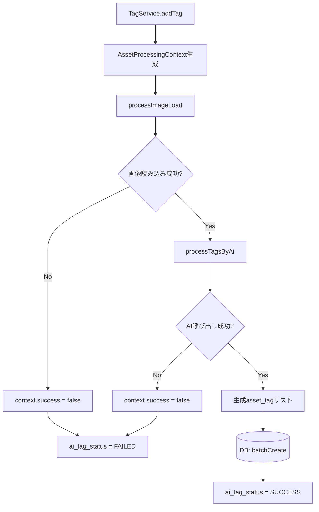
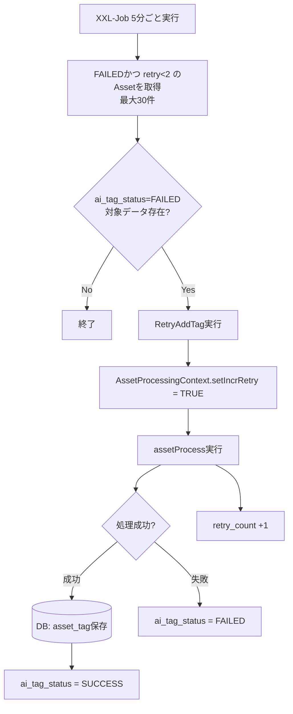
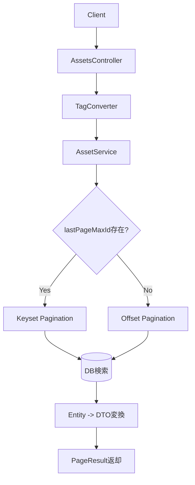

# AI自動タグ付け機能を想定した画像アセット管理API

[TOC]

## 1. プロジェクト概要

本プロジェクトは、「デジタルアセット管理（DAM）」機能を想定し、

- アセット登録
- タグ検索
- AIによる自動タグ付与

を提供する軽量REST APIとして実装したものです。

------

## 2. 使用技術

| 分類         | 技術                                   |
|------------|--------------------------------------|
| 言語         | Java 17                              |
| フレームワーク    | Spring Boot 3.5                      |
| ORM        | Spring Data JPA                      |
| DB         | H2 / MySQL想定                         |
| 非同期        | RocketMQ     / Spring Event          |
| 定期実行       | XXL-Job                              |
| AI連携       | Spring AI （Ollamaのllama3.2-vision利用） |
| HTTPクライアント | OkHttp3                              |
| DTO変換      | MapStruct                            |
| Validation | Spring Validation                    |

------

## 3. アーキテクチャ設計

### 3.1 主要なパッケージ構成

| パッケージ          | 説明                   |
|----------------|----------------------|
| config         | 各種設定                 |
| domain         | ドメインモデル層             |
| service        | 業務ロジック層              |
| infrastructure | 外部連携・永続化層（AI/MQ/DB）  |
| trigger        | 外部I/F層（HTTP・MQ・Task） |

責務分離を明確化し、拡張容易性を確保している。

------

## 3.2 アセット登録フロー（mqモード）



## 3.3 AIタグ付与内部処理フロー



## 3.4 XXL-Jobリトライフロー



## 3.5 タグ検索フロー



# 4 API設計

## 4.1 アセット登録

### Endpoint

```
POST /api/assets
```

### Request Body

```json
{
  "title": "sample image",
  "filePath": "/images/sample.jpg"
}
```

### バリデーション

| 項目       | NN | 説明      |
|----------|----|---------|
| title    | ○  | 最大255文字 |
| filePath | ○  | 最大500文字 |

------

### Response

```json
{
  "status": 0,
  "message": "success"
}
```

------

## 4.2 タグ検索

### Endpoint

```
GET /api/assets/search
```

### Query Parameter

| パラメータ         | NN | 説明                 |
|---------------|----|--------------------|
| tag           | ○  | タグ                 
| pageIndex     |    | デフォルト1             |
| pageSize      |    | デフォルト20（最大20）      |
| lastPageMaxId |    | Keyset Pagination用 |

------

### ページング設計

- 通常ページング（OFFSETベース）
- 大規模データ対応として lastPageMaxId によるKeyset Paginationも考慮

パフォーマンス劣化を防ぐ設計とした。

------

### Response

```json
{
  "status": 0,
  "message": "success",
  "data": {
    "count": 100,
    "pageSize": 20,
    "pageIndex": 1,
    "records": [
      {
        "id": 1,
        "title": "sample image",
        "filePath": "/images/sample.jpg"
      }
    ]
  }
}
```

# 5 DB設計

## 5.1 テーブル構成

| No | テーブル名     | 論理名      | 概要         |
|----|-----------|----------|------------|
| 1  | asset     | アセット情報   | デジタルアセット管理 |
| 2  | tag       | タグ情報     | タグマスタ管理    |
| 3  | asset_tag | アセットタグ関連 | 多対多関連管理    |

## 5.2 テーブル定義

### 5.2.1 asset テーブル

#### 概要

デジタルアセット情報およびAIタグ付与状態を管理するテーブル。

#### カラム定義

| No | カラム名               | 型            | PK | NN | 初期値               | 説明       |
|----|--------------------|--------------|----|----|-------------------|----------|
| 1  | id                 | BIGINT       | ○  | ○  | AUTO_INCREMENT    | アセットID   |
| 2  | title              | VARCHAR(255) |    | ○  |                   | アセットタイトル |
| 3  | file_path          | VARCHAR(500) |    | ○  |                   | ファイル保存パス |
| 4  | ai_tag_status      | VARCHAR(20)  |    | ○  | PENDING           | AIタグ付与状態 |
| 5  | ai_tag_retry_count | INT          |    | ○  | 0                 | リトライ回数   |
| 6  | ai_tag_fail_reason | VARCHAR(500) |    |    | ''                | 失敗理由     |
| 7  | create_time        | TIMESTAMP    |    | ○  | CURRENT_TIMESTAMP | 作成日時     |
| 8  | update_time        | TIMESTAMP    |    |    | NULL              | 更新日時     |
| 9  | delete_time        | TIMESTAMP    |    |    | NULL              | 論理削除日時   |
| 10 | deleted            | BOOLEAN      |    | ○  | FALSE             | 論理削除フラグ  |

------

#### AI状態遷移

| 状態      | 説明     |
|---------|--------|
| PENDING | タグ付与待ち |
| SUCCESS | タグ付与成功 |
| FAILED  | タグ付与失敗 |

------

#### リトライ制御仕様

- FAILED 状態
- ai_tag_retry_count < 指定回数（最大2回）
- 定期バッチ（XXL-Job）により再実行
- 再実行時に ai_tag_retry_count を +1 更新

------

#### インデックス設計

| インデックス名       | カラム                                          | 目的          |
|---------------|----------------------------------------------|-------------|
| idx_tag_retry | (ai_tag_status, ai_tag_retry_count, deleted) | リトライ対象検索高速化 |

------

### 5.2.2 tag テーブル

#### 概要

タグマスタ情報を管理する。

#### カラム定義

| No | カラム名        | 型            | PK | NN | 初期値               | 説明         |
|----|-------------|--------------|----|----|-------------------|------------|
| 1  | id          | BIGINT       | ○  | ○  | AUTO_INCREMENT    | タグID       |
| 2  | name        | VARCHAR(100) |    | ○  |                   | タグ名称（ユニーク） |
| 3  | category    | VARCHAR(100) |    |    | ''                | カテゴリ       |
| 4  | create_time | TIMESTAMP    |    |    | CURRENT_TIMESTAMP | 作成日時       |
| 5  | delete_time | TIMESTAMP    |    |    | NULL              | 論理削除日時     |
| 6  | deleted     | BOOLEAN      |    | ○  | FALSE             | 論理削除フラグ    |

------

#### インデックス設計

| インデックス名          | カラム             | 目的      |
|------------------|-----------------|---------|
| idx_name_deleted | (name, deleted) | タグ検索高速化 |

------

### 5.2.3 asset_tag テーブル

#### 概要

Asset と Tag の多対多関係を管理する中間テーブル。

------

#### カラム定義

| No | カラム名             | 型           | PK | NN | 初期値               | 説明               |
|----|------------------|-------------|----|----|-------------------|------------------|
| 1  | id               | BIGINT      | ○  | ○  | AUTO_INCREMENT    | 主キー              |
| 2  | asset_id         | BIGINT      |    | ○  |                   | アセットID           |
| 3  | tag_id           | BIGINT      |    | ○  |                   | タグID             |
| 4  | source           | VARCHAR(20) |    | ○  |                   | タグ付与元（USER / AI） |
| 5  | confidence_score | DOUBLE      |    |    |                   | AI信頼度（0.0〜1.0）   |
| 6  | create_time      | TIMESTAMP   |    | ○  | CURRENT_TIMESTAMP | 作成日時             |
| 7  | delete_time      | TIMESTAMP   |    |    | NULL              | 論理削除日時           |
| 8  | deleted          | BOOLEAN     |    | ○  | FALSE             | 論理削除フラグ          |

------

#### インデックス設計

| インデックス名          | カラム                         | 目的           |
|------------------|-----------------------------|--------------|
| idx_tag_asset_id | (tag_id, asset_id, deleted) | タグ→アセット検索高速化 |
| idx_asset_id     | (asset_id, deleted)         | アセット→タグ検索高速化 |

------

### 5.3 ER関係

```
Asset（1）—（n）Asset_Tag（n）—（1）Tag

```

Asset と Tag は多対多関係。

------

# 6 実行条件

## 6.1 実行環境

本プロジェクトの基本実行環境は以下の通り。

| 項目       | 内容                |
|----------|-------------------|
| Java     | 17 以上             |
| Maven    | 3.8 以上            |
| Ollama   | llama3.2-vision   |
| メッセージキュー | RocketMQ（利用時のみ必要） |
| 定期タスク    | XXL-Job（利用時のみ必要）  |

## 6.2 本番想定構成

```
config:
  ai:
    method: spring
  tag:
    add: mq
  task: xxl
```

### 動作内容

- AI連携：Spring AI
- 非同期処理：RocketMQ
- リトライ制御：XXL-Job
- DB：MySQL等のRDB想定

スケーラビリティおよび耐障害性を考慮した構成。

------

## 6.3 設定切替項目

本プロジェクトでは、以下の設定により動作方式を切り替えることが可能。

------

### ① AI呼び出し方式

```
config:
  ai:
    method: spring
```

| 設定値    | 説明                   |
|--------|----------------------|
| mock   | モック実装                |
| http   | HTTPクライアント実装         |
| spring | Spring AI経由実装（デフォルト） |

------

### ② タグ付与イベント送信方式

```
config:
  tag:
    add: event
```

| 設定値   | 説明                             |
|-------|--------------------------------|
| event | Spring ApplicationEvent（デフォルト） |
| mq    | RocketMQ                       |

mq を指定した場合、タグ付与処理はRocketMQ経由で非同期実行される。

### ③ 定期タスク実行方式

```
config:
  task: xxl
```

| 設定値 | 説明               |
|-----|------------------|
| 未設定 | 無効       （デフォルト） |
| xxl | XXL-Job利用        |

XXL-Jobを利用する場合は、管理画面でジョブ登録が必要。

------

# 7. 設計上の工夫

- DTOとEntityの責務分離
- MapStructによる型安全な変換処理
- Validationによる入力値検証
- 論理削除設計の採用
- AI処理状態の明確化
- 非同期リトライ機構の設計
- レイヤ分離による保守性向上
- 設定による実行方法を切り替え
- 共通レスポンス構造の統一
- グローバル例外ハンドリングによるエラーハンドリングの一元化
- 外部複数API連携の段階分離設計による障害影響局所化

# 8. 将来拡張

- S3等の外部ストレージ連携対応
- Redisによるキャッシュ最適化
- Elasticsearchによる全文検索機能強化
- テナント分離機構の導入によるマルチテナント対応
- Asset種別管理機能の追加（画像・動画・文書対応）


