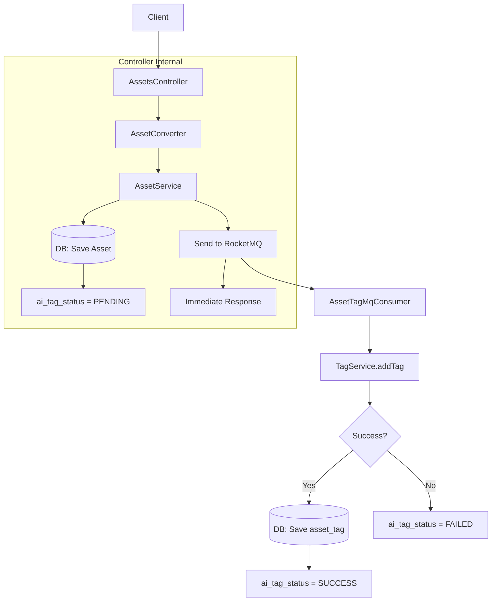
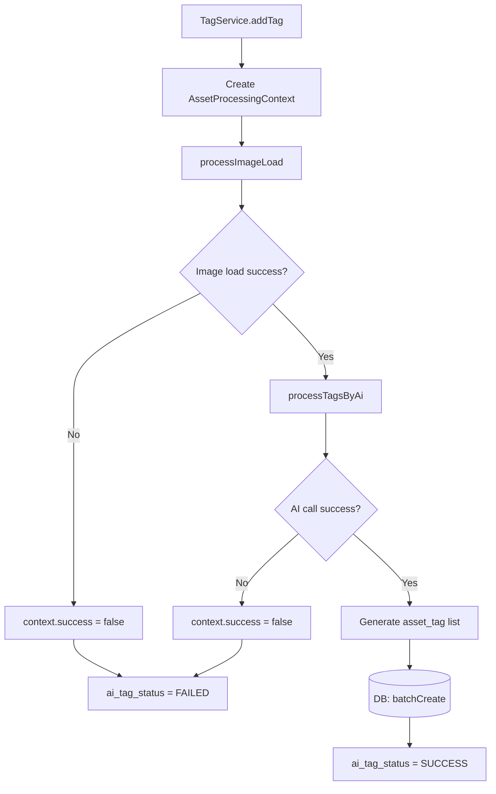
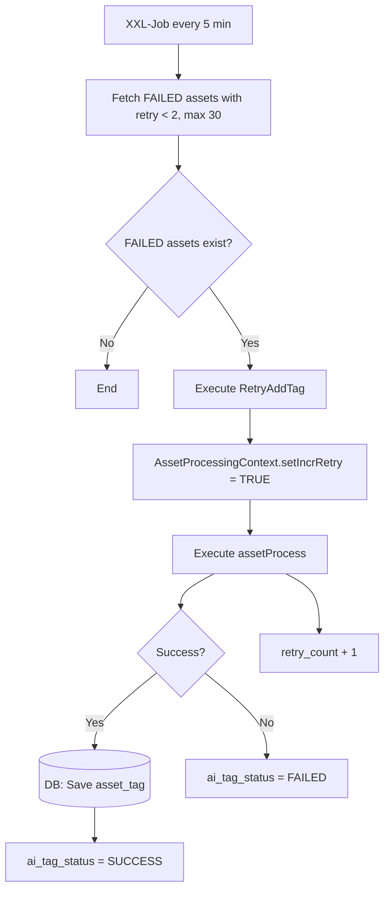
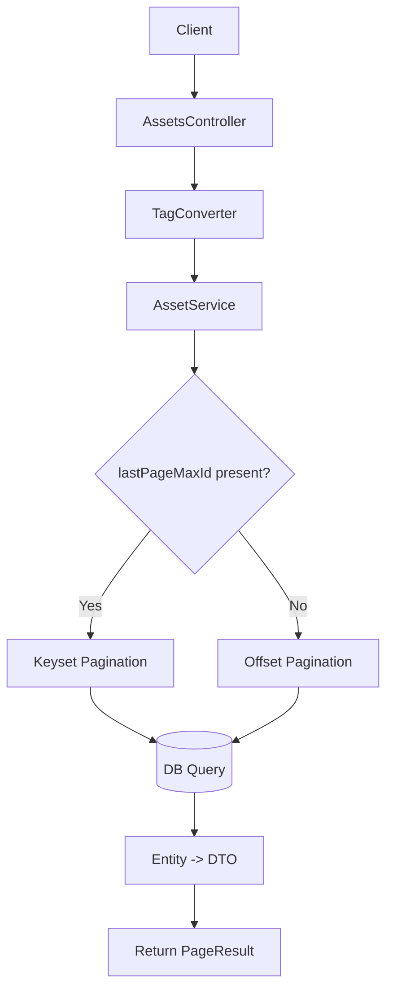

# Image Asset Management API with AI Auto-Tagging
> 📄 [日本語版 README](./README.jp.md)

## Table of Contents

- [1. Project Overview](#1-project-overview)
- [2. Tech Stack](#2-tech-stack)
- [3. Architecture Design](#3-architecture-design)
- [4. API Design](#4-api-design)
- [5. DB Design](#5-db-design)
- [6. Running the Project](#6-running-the-project)
- [7. Design Highlights](#7-design-highlights)
- [8. Future Extensions](#8-future-extensions)

---

## 1. Project Overview

This project implements a lightweight REST API simulating a **Digital Asset Management (DAM)** system, providing:

- Asset registration
- Tag-based search
- AI-powered automatic tag assignment

---

## 2. Tech Stack

| Category        | Technology                              |
|-----------------|-----------------------------------------|
| Language        | Java 17                                 |
| Framework       | Spring Boot 3.5                         |
| ORM             | Spring Data JPA                         |
| Database        | H2 / MySQL (production)                 |
| Async           | RocketMQ / Spring Event                 |
| Scheduled Tasks | XXL-Job                                 |
| AI Integration  | Spring AI (Ollama llama3.2-vision)      |
| HTTP Client     | OkHttp3                                 |
| DTO Mapping     | MapStruct                               |
| Validation      | Spring Validation                       |

---

## 3. Architecture Design

### 3.1 Package Structure

| Package        | Description                                          |
|----------------|------------------------------------------------------|
| config         | Application configuration                            |
| domain         | Domain model layer                                   |
| service        | Business logic layer                                 |
| infrastructure | External integrations & persistence (AI / MQ / DB)  |
| trigger        | External interface layer (HTTP / MQ / Scheduled Tasks) |

Clear separation of responsibilities ensures extensibility.

---

### 3.2 Asset Registration Flow (MQ Mode)



### 3.3 AI Tag Assignment Internal Flow



### 3.4 XXL-Job Retry Flow



### 3.5 Tag Search Flow



---

## 4. API Design

### 4.1 Asset Registration

#### Endpoint

```
POST /api/assets
```

#### Request Body

```json
{
  "title": "sample image",
  "filePath": "/images/sample.jpg"
}
```

#### Validation

| Field    | Required | Description     |
|----------|----------|-----------------|
| title    | ✅       | Max 255 chars   |
| filePath | ✅       | Max 500 chars   |

#### Response

```json
{
  "status": 0,
  "message": "success"
}
```

---

### 4.2 Tag Search

#### Endpoint

```
GET /api/assets/search
```

#### Query Parameters

| Parameter     | Required | Description                      |
|---------------|----------|----------------------------------|
| tag           | ✅       | Tag name                         |
| pageIndex     |          | Default: 1                       |
| pageSize      |          | Default: 20 (max: 20)            |
| lastPageMaxId |          | For Keyset Pagination            |

#### Pagination Design

- Standard offset-based pagination
- Keyset Pagination via `lastPageMaxId` for large datasets to prevent performance degradation

#### Response

```json
{
  "status": 0,
  "message": "success",
  "data": {
    "count": 100,
    "pageSize": 20,
    "pageIndex": 1,
    "records": [
      {
        "id": 1,
        "title": "sample image",
        "filePath": "/images/sample.jpg"
      }
    ]
  }
}
```

---

## 5. DB Design

### 5.1 Table Overview

| No | Table Name | Logical Name        | Description                    |
|----|------------|---------------------|--------------------------------|
| 1  | asset      | Asset Info          | Digital asset management       |
| 2  | tag        | Tag Info            | Tag master management          |
| 3  | asset_tag  | Asset-Tag Relation  | Many-to-many relationship      |

---

### 5.2 Table Definitions

#### 5.2.1 `asset` Table

Manages digital asset information and AI tag assignment status.

| No | Column             | Type         | PK | NN | Default           | Description           |
|----|--------------------|--------------|----|----|--------------------|----------------------|
| 1  | id                 | BIGINT       | ✅ | ✅ | AUTO_INCREMENT     | Asset ID             |
| 2  | title              | VARCHAR(255) |    | ✅ |                    | Asset title          |
| 3  | file_path          | VARCHAR(500) |    | ✅ |                    | File storage path    |
| 4  | ai_tag_status      | VARCHAR(20)  |    | ✅ | PENDING            | AI tag status        |
| 5  | ai_tag_retry_count | INT          |    | ✅ | 0                  | Retry count          |
| 6  | ai_tag_fail_reason | VARCHAR(500) |    |    | ''                 | Failure reason       |
| 7  | create_time        | TIMESTAMP    |    | ✅ | CURRENT_TIMESTAMP  | Created at           |
| 8  | update_time        | TIMESTAMP    |    |    | NULL               | Updated at           |
| 9  | delete_time        | TIMESTAMP    |    |    | NULL               | Soft-deleted at      |
| 10 | deleted            | BOOLEAN      |    | ✅ | FALSE              | Soft-delete flag     |

##### AI Status Transitions

| Status  | Description           |
|---------|-----------------------|
| PENDING | Awaiting tag assignment |
| SUCCESS | Tag assignment succeeded |
| FAILED  | Tag assignment failed  |

##### Retry Control Spec

- Target: assets with `FAILED` status and `ai_tag_retry_count < max (2)`
- Re-executed by the scheduled batch (XXL-Job)
- `ai_tag_retry_count` is incremented on each retry

##### Index Design

| Index Name    | Columns                                        | Purpose                      |
|---------------|------------------------------------------------|------------------------------|
| idx_tag_retry | (ai_tag_status, ai_tag_retry_count, deleted)  | Speed up retry target queries |

---

#### 5.2.2 `tag` Table

Manages tag master information.

| No | Column      | Type         | PK | NN | Default           | Description        |
|----|-------------|--------------|----|----|--------------------|--------------------|
| 1  | id          | BIGINT       | ✅ | ✅ | AUTO_INCREMENT     | Tag ID             |
| 2  | name        | VARCHAR(100) |    | ✅ |                    | Tag name (unique)  |
| 3  | category    | VARCHAR(100) |    |    | ''                 | Category           |
| 4  | create_time | TIMESTAMP    |    |    | CURRENT_TIMESTAMP  | Created at         |
| 5  | delete_time | TIMESTAMP    |    |    | NULL               | Soft-deleted at    |
| 6  | deleted     | BOOLEAN      |    | ✅ | FALSE              | Soft-delete flag   |

##### Index Design

| Index Name       | Columns          | Purpose             |
|------------------|------------------|---------------------|
| idx_name_deleted | (name, deleted)  | Speed up tag search |

---

#### 5.2.3 `asset_tag` Table

Junction table managing the many-to-many relationship between Asset and Tag.

| No | Column           | Type        | PK | NN | Default           | Description                |
|----|------------------|-------------|----|----|-------------------|----------------------------|
| 1  | id               | BIGINT      | ✅ | ✅ | AUTO_INCREMENT    | Primary key                |
| 2  | asset_id         | BIGINT      |    | ✅ |                   | Asset ID                   |
| 3  | tag_id           | BIGINT      |    | ✅ |                   | Tag ID                     |
| 4  | source           | VARCHAR(20) |    | ✅ |                   | Tag source (USER / AI)     |
| 5  | confidence_score | DOUBLE      |    |    |                   | AI confidence (0.0 ~ 1.0)  |
| 6  | create_time      | TIMESTAMP   |    | ✅ | CURRENT_TIMESTAMP | Created at                 |
| 7  | delete_time      | TIMESTAMP   |    |    | NULL              | Soft-deleted at            |
| 8  | deleted          | BOOLEAN     |    | ✅ | FALSE             | Soft-delete flag           |

##### Index Design

| Index Name       | Columns                        | Purpose                      |
|------------------|--------------------------------|------------------------------|
| idx_tag_asset_id | (tag_id, asset_id, deleted)   | Speed up tag → asset queries |
| idx_asset_id     | (asset_id, deleted)           | Speed up asset → tag queries |

---

### 5.3 ER Relationship

```
Asset (1) — (n) Asset_Tag (n) — (1) Tag
```

Asset and Tag have a many-to-many relationship managed through the `asset_tag` junction table.

---

## 6. Running the Project

### 6.1 Environment Requirements

| Item            | Requirement              |
|-----------------|--------------------------|
| Java            | 17+                      |
| Maven           | 3.8+                     |
| Ollama          | llama3.2-vision          |
| Message Queue   | RocketMQ (if enabled)    |
| Scheduled Tasks | XXL-Job (if enabled)     |

### 6.2 Production Configuration

```yaml
config:
  ai:
    method: spring
  tag:
    add: mq
  task: xxl
```

This configuration enables:
- AI integration via Spring AI
- Async processing via RocketMQ
- Retry control via XXL-Job
- Production DB (MySQL or equivalent RDB)

---

### 6.3 Configuration Options

#### ① AI Call Method

```yaml
config:
  ai:
    method: spring
```

| Value  | Description                           |
|--------|---------------------------------------|
| mock   | Mock implementation                   |
| http   | HTTP client implementation            |
| spring | Spring AI implementation (default)    |

#### ② Tag Assignment Event Method

```yaml
config:
  tag:
    add: event
```

| Value | Description                                  |
|-------|----------------------------------------------|
| event | Spring ApplicationEvent (default)            |
| mq    | RocketMQ (async via message queue)           |

#### ③ Scheduled Task Method

```yaml
config:
  task: xxl
```

| Value      | Description              |
|------------|--------------------------|
| (not set)  | Disabled (default)       |
| xxl        | XXL-Job                  |

> When using XXL-Job, job registration in the admin console is required.

---

## 7. Design Highlights

- Clear separation of DTO and Entity responsibilities
- Type-safe object mapping with MapStruct
- Input validation via Spring Validation
- Soft-delete design adopted throughout
- Explicit AI processing status management
- Async retry mechanism design
- Layer separation for improved maintainability
- Runtime behavior switchable via configuration
- Unified common response structure
- Centralized error handling via global exception handler
- Staged integration design for multiple external APIs to isolate failure impact

---

## 8. Future Extensions

- External storage integration (e.g., Amazon S3)
- Cache optimization with Redis
- Full-text search enhancement with Elasticsearch
- Multi-tenant support with tenant isolation mechanism
- Asset type management (images, videos, documents)
